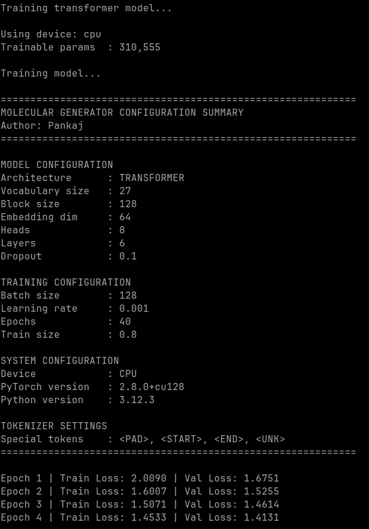
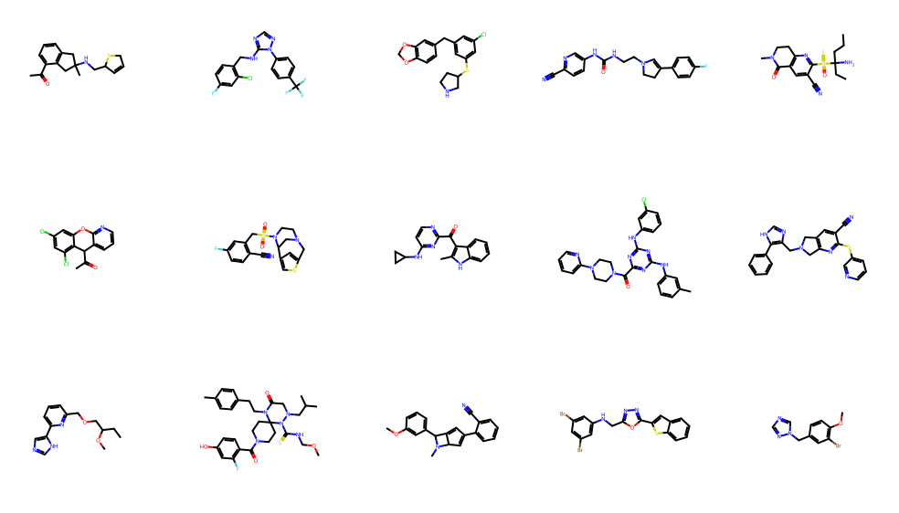

# Molecular Generator

A deep learning framework for  molecular generation using SMILES  representations, supporting multiple architectures including **LSTM**, Transformer, and Autoencoder, with optional 
reinforcement learning–based property optimization. This project enables training generative models for molecules and evaluating them using chemical validity, novelty, uniqueness, and descriptor-based analysis.

---

## Steps
- SMILES  preprocessing support
- Tokenization pipeline
- LSTM-based molecular generator
- Transformer-based molecular generator
- - Reinforcement Learning Optimization

## Extensions 
- Autoencoder latent representation learning
- Property-based reinforcement learning optimization
- Sampling utilities with temperature/top-k support

---
## Training Models

```bash
python -m Molecule-Generation.main train
python -m Molecule-Generation.main sample
```


Example output:
```
Generated SMILES:
CCN(CC)CC...
CCC(C)CO...
CCOC(=O)N...
```


---

## Configuration

```
configs/config.yaml
```
Example parameters:

```
architecture
embedding_dim
hidden_dim
n_layers
dropout
block_size
learning_rate
batch_size
```


```bash
python main.py
```

Supports:

```
preprocess
train
optimizw
generate
```
